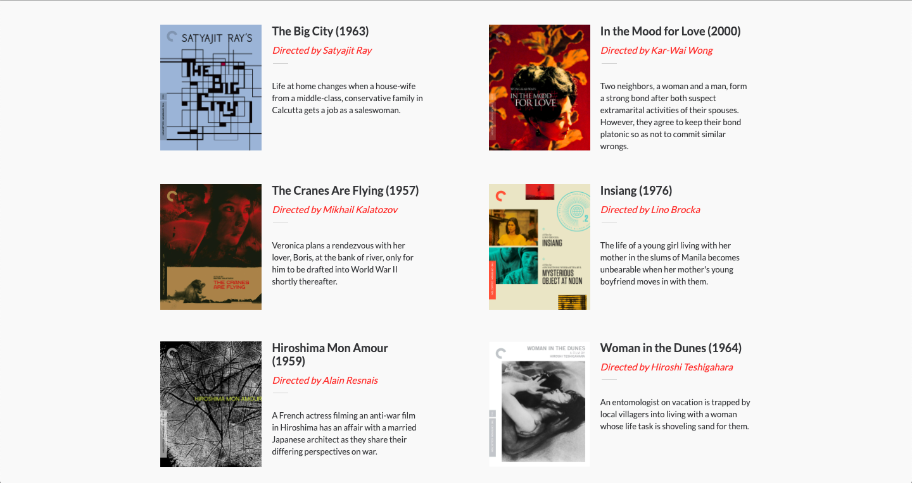

# IFF: Internal Film Festival

> Capstone project for the HTML & CSS3 Module

A mobile-first webpage for a fictional film festival.

## Built With

- HTML5 & CSS3

## Live Demo

[Live Demo Link](https://chuckbuckethead.github.io/microverse-film-festival-page/)

## Authors

👤 **Carlos González**

- GitHub: [@chuckbuckethead](https://github.com/chuckbuckethead)
- Twitter: [@aclerkofpomier](https://twitter.com/aclerkofpomier)
- LinkedIn: [Carlos González](https://www.linkedin.com/in/chuckbuckethead/)

## Show your support

Give a ⭐️ if you like this project!

## Acknowledgments

- [Design idea](https://www.behance.net/gallery/29845175/CC-Global-Summit-2015) by [Cindy Shin](https://www.behance.net/adagio07) in Behance.

## 📝 License

This project is [Creative Commons](https://creativecommons.org/licenses/by-nc/4.0/) licensed.
